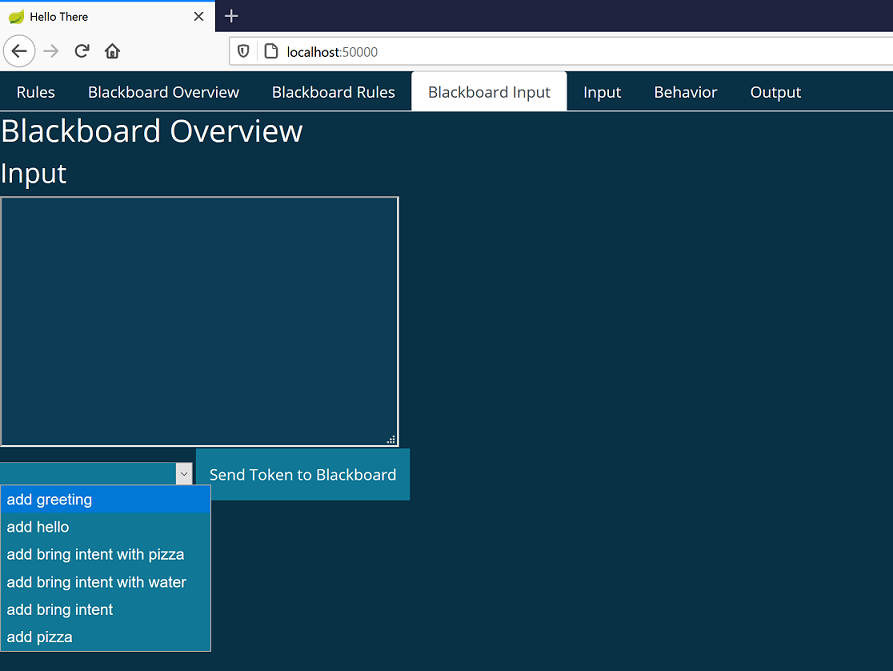

# Basic Examples for StepDP Versions >= 0.9.0

This projects contains some code examples that show how to build a dialog system with StepDP. For each example, there is a more detailed description in the [StepDP documentation](http://stepdp.sb.dfki.de). The respective links are provided below. The following examples are currently available:

- **HelloWorldExample**: Most basic example, which shows how to define simple dialog rules (<http://stepdp.sb.dfki.de/stepdp/rules/simple_rule/>).
- **PatternConditionExample**: Shows how to define slightly more advanced conditions for dialog rules (<http://stepdp.sb.dfki.de/stepdp/rules/pattern_condition/>).
- **DeclarativeTypeBasedFusionExample**: Shows how to define fusion rules. (<http://stepdp.sb.dfki.de/stepdp/rules/declarative_type_based_fusion/>).

### How to run the examples

The application.yaml file specifies which example is executed. Per default, it selects the **HelloWorldExample**. To select a different example, e.g. the **PatternConditionExample**, replace

``` yaml
dialog:
  name: basic_examples.HelloWorldExample
```
with

``` yaml
dialog:
  name: basic_examples.PatternConditionExample
```

To run the selected example, simply run the *Main* class in your IDE.

While running an example, you can send input in JSON format to StepDP via its Debug Web UI, which runs on port 50000. The corresponding tab is called "Blackboard Input". For each code example, example JSON inputs should be available in the drop-down list:



Here's an overview of which example JSON inputs to select for which example:
- **HelloWorldExample**:
    - *"add greeting"*
- **PatternConditionExample**:
    - *"add bring intent with pizza"* or
    - *"add bring intent with water"*
- **DeclarativeTypeBasedExample**:
    - *"add bring intent"* and additionally
    - *"add pizza"*
  
Of course, you can also create your own JSON inputs or vary the ones that are provided to experiment a little. Just make sure that they comply with the semantic tree defined in the corresponding code example (or extend the semantic tree yourself).